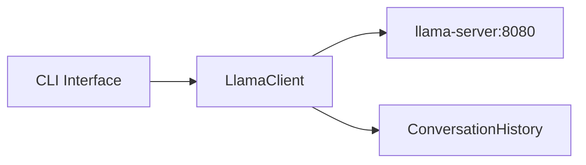

# TypeScript CLI Chatbot for llama-server

## Architecture



## What We'll Build

A TypeScript project with two parts:

1. **`LlamaClient`** - reusable module that handles API calls to llama-server and manages conversation history
2. **`cli.ts`** - simple terminal chat interface using readline

## File Structure

```
test/v2_1/ts-chatbot/
├── package.json
├── tsconfig.json
├── src/
│   ├── llama-client.ts    # Reusable LLM client class
│   ├── types.ts           # TypeScript interfaces
│   └── cli.ts             # CLI chat interface
```

## Key Implementation Details

### LlamaClient Class

- Calls `http://localhost:8080/v1/chat/completions` (OpenAI-compatible endpoint)
- Maintains conversation history (messages array)
- Configurable system prompt, temperature, max_tokens
- Methods: `chat(userMessage)`, `clearHistory()`, `getHistory()`

### CLI Interface

- Uses Node.js `readline` for terminal input
- Shows conversation in real-time
- Commands: `quit` to exit, `clear` to reset history

## Dependencies

- **typescript** - TypeScript compiler
- **tsx** - Run TypeScript directly without build step (for dev)
- **node-fetch** or native fetch (Node 18+)

## Future Expansion

The `LlamaClient` class will be easily reusable when you add:

- Express/Hono API server
- Web UI frontend
- Multi-agent system (like your argument simulator)